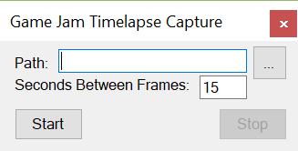
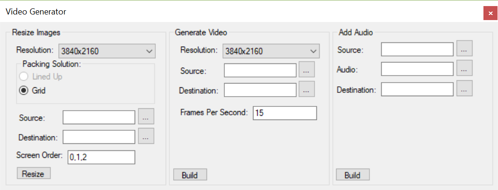

# Game Jam Time Lapse Tools
This repository has a bunch of tools which are designed to make creating time lapses for game jams a lot easier.

## Capture Tool
As the name suggests this tool captures screenshots of all your screens as you work and saves them into a folder.

Once you hit start it will minimise itself to the notification area.

## Video Generator

This tool will let you convert the snapshot created with the Capture tool into video files.

You simply follow the multiple steps layout in the window. 

* Resize - Resizes the images into the right resolution for the target video size.
* Video - Generates a video file out of the images.
* Audio - Adds an audio track to the video.

At this point you are ready to upload the video to YouTube.

# Installation
To install the tool simply download the Zip file of the latest version under the Releases tab and extract it.

# Contribution / Bugs
Please use the git issues tracker to log any bugs or add feature requests.
If you would like to make a contribution please first raise a issue for it first and then send a pull request.